## 项目起源

工欲善其事必先利其器，无论是工作还是生活，我们都希望自己的工具足够趁手。其中一个典型的例子就是异地组网问题，如果想在公司访问家中的服务器，我们可以怎么做？

### 网络运营商提供公网 IP

这是最简洁高效的方式了，实现的关键是路由器支持 NAT 映射，同时运营商还提供了一个稳定的公网 IP。

如果内网服务众多，维护 NAT 映射表也是一件费心的事，也没办法做到在公司直接访问家里的 IP。因此我们需要借助 openvpn 帮助我们实现这件事，网络架构演变成了这样：

NAT 映射表只需要维护一个 openvpn 的映射，在公司建立好 vpn 连接，就可以像在内网一样，直接访问家中的 IP。

但是在 IPv4 近乎枯竭的今天，向运营商索要公网 IP 成了一种奢求，这种方式在大多数情况下并不适用。

### 内网穿透

内网穿透对上面的网络架构并没有什么本质的提升，只是单纯的解决运行商无法提供公网 IP 的问题。购买云厂商提供的 ECS 时会附带的一个公网 IP，我们将这个 IP 作为所有流量的入口，通过内网穿透软件转发到内网环境。

内网穿透是一种典型的反向思维。正常情况下，内网是**主动**可以访问公网的，但是公网无法**主动**访问内网：

那我们即使有了公网 ECS 又怎么把流量转发到内网呢？这时候就需要使用内网穿透软件了，常用的有 frp、nps 等。以 nps 举例，nps 有 server 端需要部署在 ECS 上，同时在内网还要有一台服务器部署 nps 的 client 端。client 启动时需要指定 server 端地址，二者随即建立起一条连接隧道。server 端此时就承担了类似 Router 的角色，在上面也可以配置类似 NAT 映射表一样的东西。假设 ECS 的公网 IP 为 49.232.15.194，内网有服务 192.168.8.10:1194 需要代理：

1. 在 server 端新建映射配置：8080 => 192.168.8.10:1194

2. 在公司电脑请求 49.232.15.194:8080

3. server 端接收到请求后，会把完整的请求体打包，通过与内网建立的隧道发送给内网 client，client 接收到请求后进行解包得到原始请求体，然后模拟请求 192.168.8.10:1194 将数据发给目标。

4. client 得到请求响应后，将响应体打包通过隧道回传给 server 端，server 端解包将原始响应体回送给公司电脑，完成一次请求。

加入之前提到过的 openvpn，我们的网络架构变成了这样：

因为所有的流量都要经过 ECS 转发，随即带来了新的问题。云厂商提供的带宽一般有两种收费模式，包年包月模式如果想要高带宽实在是太贵了，按量计费可以在获得高带宽的情况下尽可能的控制成本，在日常办公场景下一个月也花不了几块钱，但是在传输大文件的场景下又变得束手束脚了。

同时因为 nps 的存在，不可避免的会拉高延迟，进一步降低用户体验。

**那么有没有一种方式，既可以解决公网 IP 的问题，又可以使得流量不经过 ECS 中转呢？**

### P2P

上面提到的内网穿透模式，本质上还是传统的 C/S 架构，即两端成端不对等的职责，系统的健壮性完全由 S 端决定。但实际上每个网络节点都是网络完备的，
